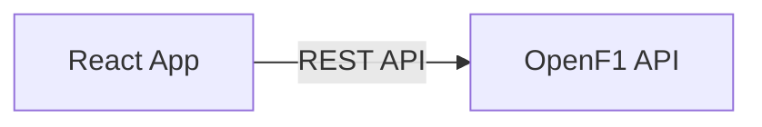

# OpenF1からFastF1への移行コンセプト

## 1. 背景と目的

現在、F1 DashboardはOpenF1 API（REST API）をフロントエンドから直接呼び出してデータを取得しています。しかし、以下の課題が顕在化しています。

*   **データ欠損**: 一部のラップデータやテレメトリーデータが欠落している（例: アントネッリのLap 39欠損問題）。
*   **データ精度**: ギャップ計算やタイヤデグラデーション分析において、より高精度なデータ（正確なセクタータイム、タイヤ情報）が必要。
*   **API制限**: OpenF1のレート制限やダウンタイムのリスク。

これらを解決するため、公式F1データへのアクセスを提供するPythonライブラリ **FastF1** への移行を行います。

## 2. アーキテクチャ変更

FastF1はPythonライブラリであり、ブラウザから直接利用することはできません。そのため、**Pythonバックエンド**を導入し、フロントエンドとFastF1の間に介在させます。

### 現行 (As-Is)


### 移行後 (To-Be)
```mermaid
graph LR
    Frontend[React App] -->|REST API| Backend[Python Backend (FastAPI)]
    Backend -->|Python Library| FastF1[FastF1 Library]
    FastF1 -->|Cache| Cache[Local Cache / DB]
    FastF1 -->|Request| F1Live[F1 Live Timing API]
```

## 3. 技術スタック

*   **Backend Framework**: **FastAPI**
    *   高速、型安全性、自動ドキュメント生成（Swagger UI）が魅力。
    *   非同期処理（async/await）のサポート。
*   **Data Library**: **FastF1**
    *   F1公式データの取得、解析、キャッシュ機能を提供。
    *   Pandas DataFrame形式でのデータ操作が可能。
*   **Data Processing**: **Pandas**, **NumPy**
    *   高度なデータ分析、統計処理に使用。
*   **Cache**: **FastF1 Built-in Cache** (FileSystem) + **Redis** (Optional)
    *   FastF1のキャッシュ機能を活用し、APIリクエストを最小限に抑える。

## 4. 移行戦略

### Phase 1: バックエンド基盤構築 & プロトタイプ
*   FastAPIプロジェクトのセットアップ。
*   FastF1の導入とキャッシュ設定。
*   主要なエンドポイント（セッション一覧、ラップデータ）の実装。
*   フロントエンドからの接続テスト。

### Phase 2: 機能移行（パラレル運用）
*   既存の機能を1つずつ新バックエンドに移行する。
    1.  **セッション選択**: `SessionSelector` のデータソース切り替え。
    2.  **ラップタイム分析**: `LapTimeChart` 用データの取得。
    3.  **テレメトリー分析**: `TelemetryChart` 用データの取得（FastF1はより詳細なデータを提供可能）。
*   この期間は、OpenF1とFastAPIの両方を利用するハイブリッド構成となる可能性があります。

### Phase 3: 高度な分析機能の実装
*   FastF1ならではの機能を実装。
    *   **正確なギャップ計算**: FastF1の補正済みデータを使用。
    *   **コーナー解析**: テレメトリーデータとサーキットマップの結合。
    *   **タイヤ戦略予測**: 過去のレースデータとの比較。

### Phase 4: 完全移行 & 最適化
*   OpenF1への依存を完全に排除。
*   パフォーマンスチューニング（レスポンス時間の短縮）。
*   デプロイパイプラインの整備。

## 5. データマッピングとAPI設計

フロントエンドの改修を最小限にするため、バックエンドのレスポンス形式は可能な限り現在のOpenF1の形式（または現在のフロントエンドが期待する形式）に合わせる、あるいはフロントエンド側にアダプター層（Hook）を設けて吸収します。

### エンドポイント例

| 機能 | Method | Path | 説明 |
| :--- | :--- | :--- | :--- |
| セッション一覧 | GET | `/api/sessions` | 年、イベントごとのセッションリスト |
| ラップデータ | GET | `/api/laps` | 指定セッション、ドライバーのラップデータ |
| テレメトリー | GET | `/api/telemetry` | 指定ラップ、ドライバーの詳細テレメトリー |
| 天候データ | GET | `/api/weather` | セッション中の気温、路面温度、湿度など |

## 6. リスクと対策

*   **レスポンス速度**: FastF1はデータのロードと解析に時間がかかる場合がある。
    *   *対策*: 強力なキャッシュ戦略、バックグラウンドでのデータプリロード。
*   **デプロイ環境**: Python環境が必要になるため、Vercel等の静的ホスティングだけでは完結しない。
    *   *対策*: Render, Railway, AWS App Runner などのコンテナホスティングサービスの利用を検討。

## 7. 次のアクション

1.  `backend/` ディレクトリの作成とFastAPIプロジェクトの初期化。
2.  `requirements.txt` の作成（fastapi, uvicorn, fastf1, pandas）。
3.  簡単な「Hello World」および「セッション取得」エンドポイントの作成。
